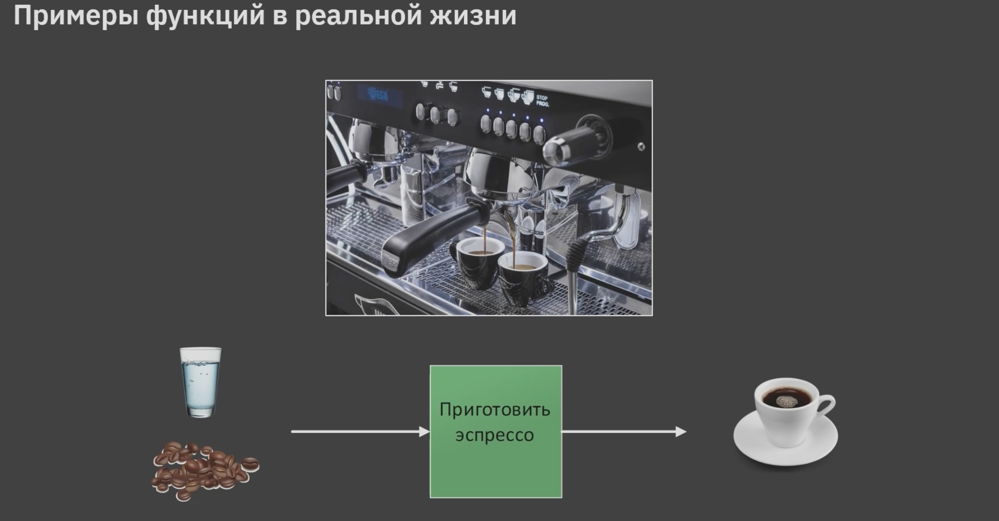
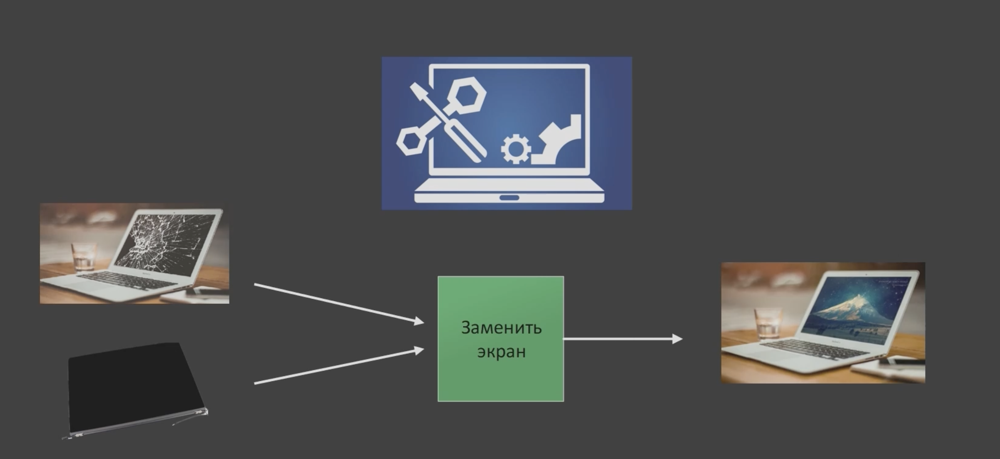
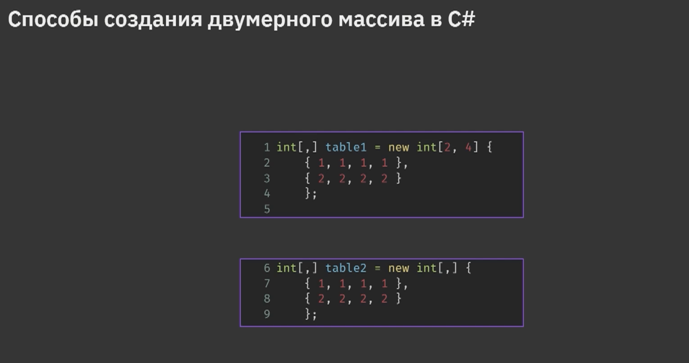
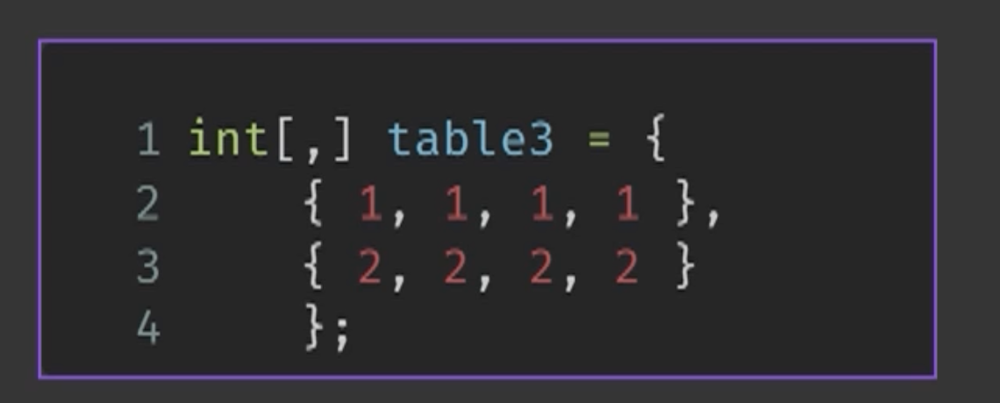

# **Функция** - блок кода, решающий пределенную задачу
* Функции для своей работы  могут требовать входные данные(параметры)
* Функции могут возвращать результат (возвращаемое число)
```sh
Входные данные - Функция - результат
```
Например функция кофеаппарата 

Или этот пример, где требуется ремонт ноутбука 


Функция
```sh
int SQUARE(int value)
{
    int result = valuee * value;
    return result;
}
```
которая принимет вход целое число и возвращает его же, только возведенный в квадрат. Оператор return используется для возврата значений.

# Двумерный массив - массив, элементами которого являются одномерные массивы одинакового размера
Другие названия двумерного массива:
* таблица
* матрица
* массив массивов

## Есть разные варианты создания масива
1. Нпример так 

или такой, самый компактный 

## Рекурсия - описание какого-либо объекта внутри этого самого объекта, то есть ситуация, когда объект является частью самого себя
Термин рекурсия наиболее широко распространен в математике и информатике

Рекурсия - процесс, в котором функция вызывает саму себя
Соответствующая функция называется рекурсивной функцией
Такой вызов называется рекурсивным вызовом

## Раскручивание рекурсии
# Раскручивание рекурсии - процесс возврата к местам вызова функций

*В памяти сохраняются*:
* места вызова функции 
* значения параметров функции при вызове

Область памяти в процессе раскручивании называется **СТЕК**.

## Цикл *for* используется когда количество итераций известно.

## Отладка - процесс поиска и исправления ошибок в программном коде

Чтобы получить первое число трехзначного числа нужно разделить 100 с тепизацией int (как вариант). Чтобы получить последнюю цыфру нужно разделить на 10 с отатком 256 % 10 = 256 -250 =6